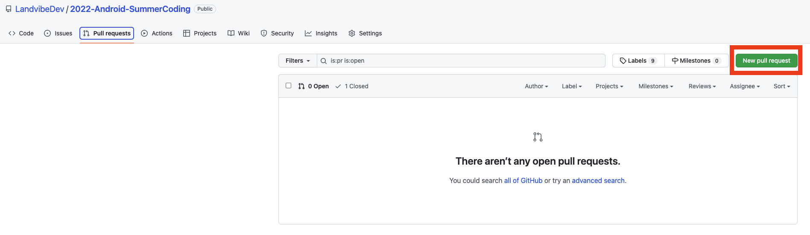
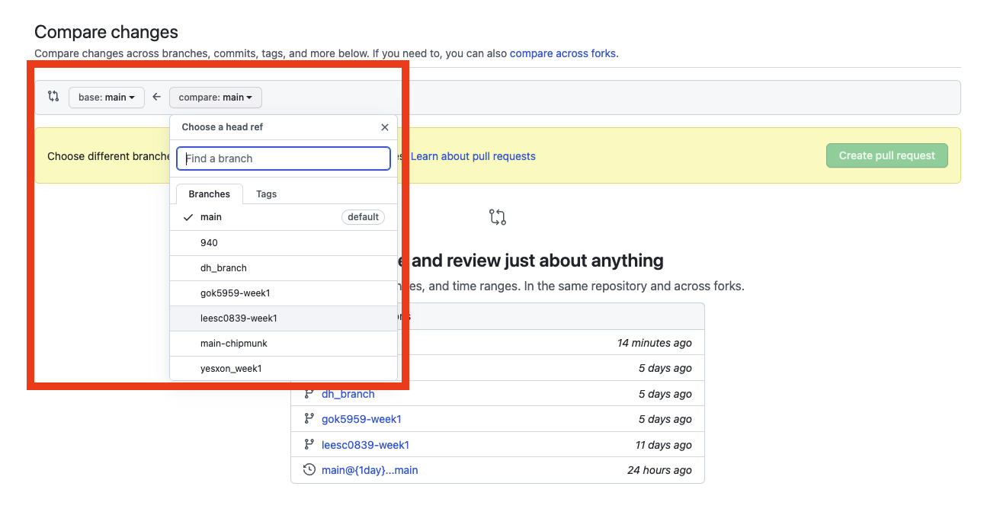
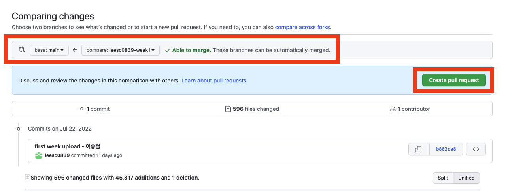
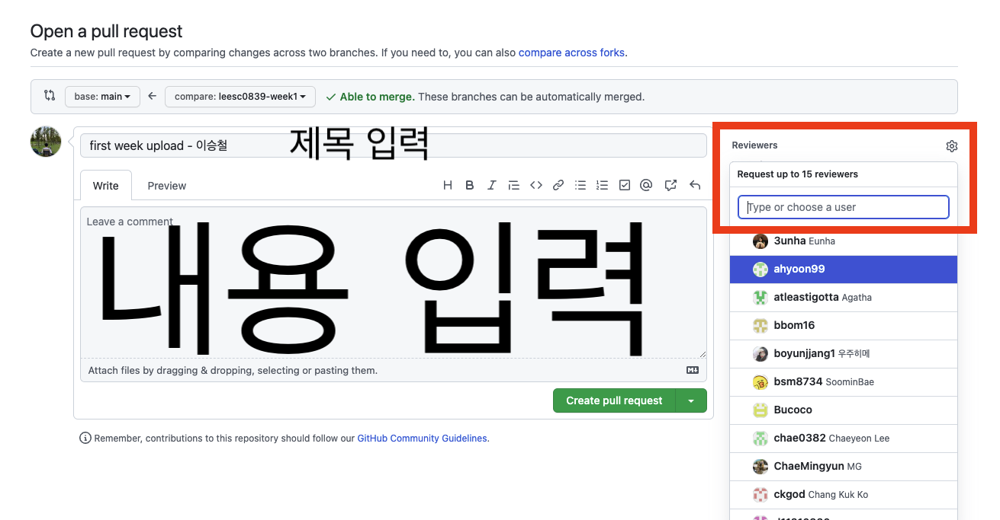
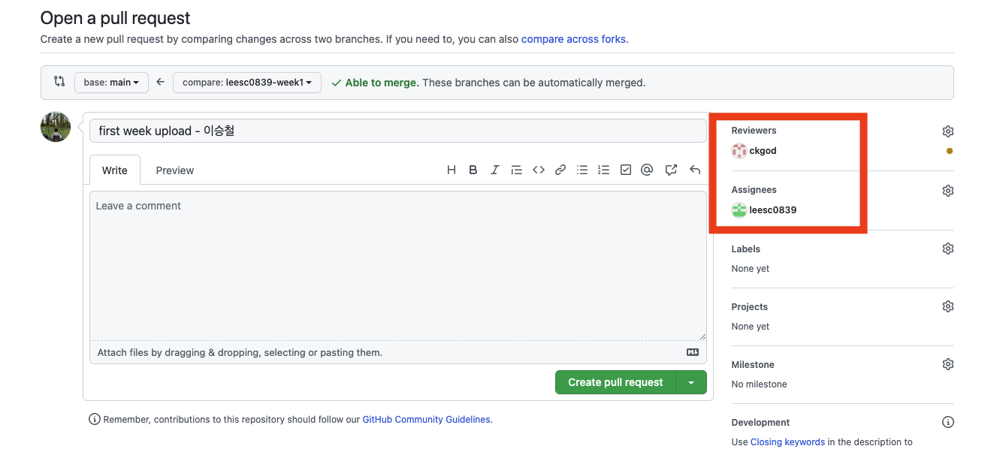
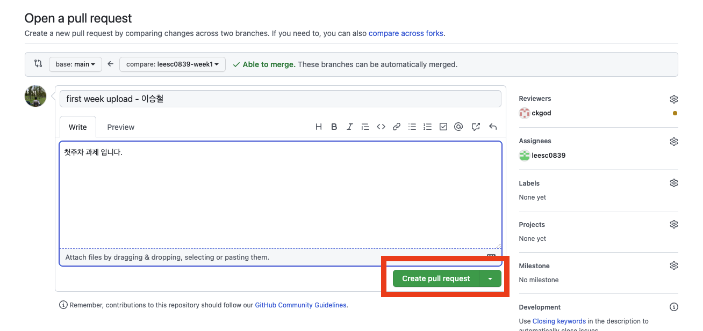
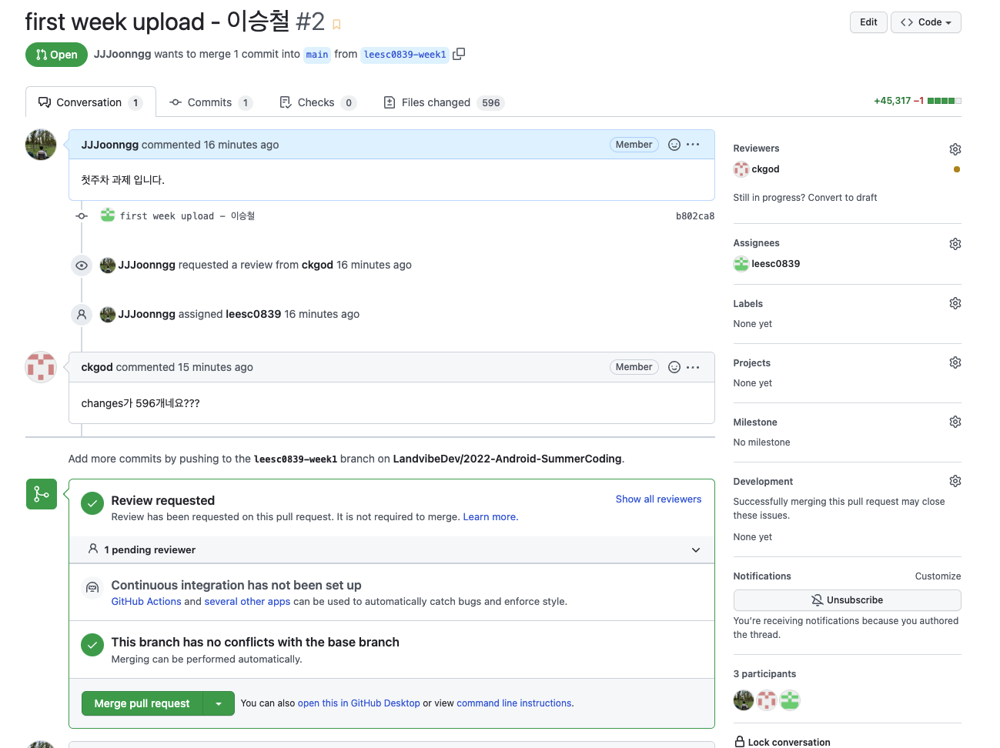

# **Pull Request 날리는 방법**

### 1. 상단 탭에서 pull request 클릭

### 2.오른쪽에 있는 `new pull requset` 버튼을 클릭

  

### 3. compare 부분을 클릭하여 자신이 작업한 브랜치를 선택

  

### 4. `base:main` 을 확인하고, 우측의 `Able to merge` 확인

#### 	4-1. 해당 able to merge 가 아닌 다른 문구가 있을 경우 멘토에게 문의 (추후 문서 작성 예정)

### 5.`create pull request` 버튼 클릭 

  

### 6. PR 의 제목과 내용을 입력 (어떤 작업을 진행했는지, 가볍게 쓰셔도 됩니다.)

### 7. Reviewers 를 클릭하여 멘토의 github ID 를 입력 하여 지정

### 8. Reviewers :arrow_right: 멘토

### 9. Assignees :arrow_right: 본인 선택 (assign yourself 클릭)

 

 

### 10. 입력된 내용들을 확인한 후 `Create pull request` 버튼 클릭

 

 

### 11. 다음과 같은 화면이 나타나면 PR 날렸다고 멘토에게 알려주기

---

추후 conflict 해결에 대해 쓸 예정~